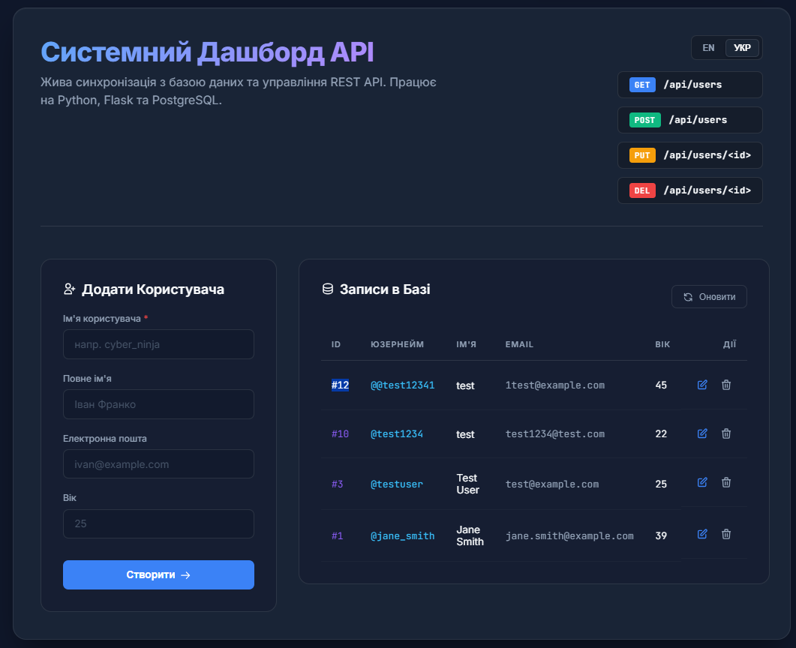
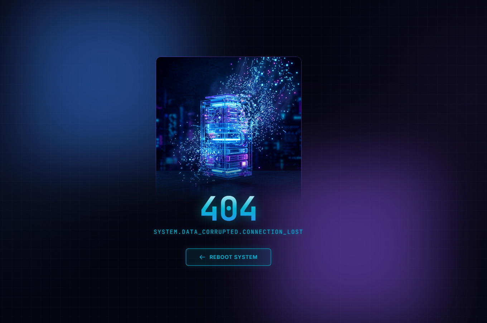
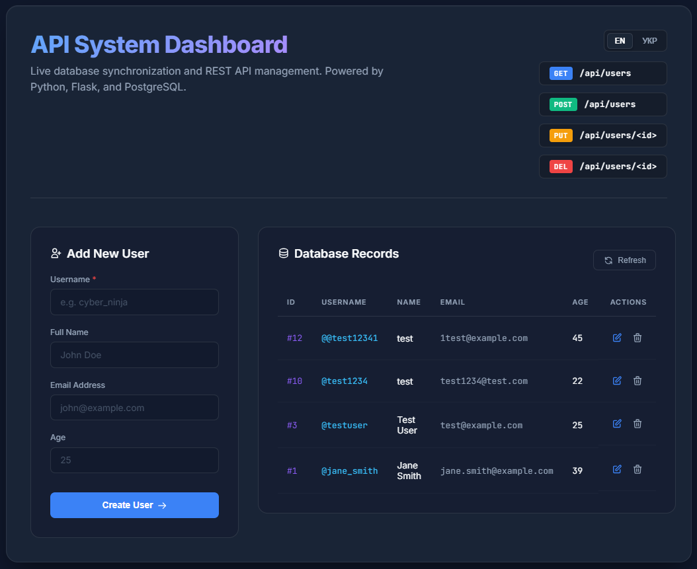

# Full-Stack PostgreSQL REST API & Dashboard

[🇺🇦 Українська](#українська-версія) | [🇺🇸 English](#english-version)

---

## <a id="українська-версія"></a>🇺🇦 Українська версія


Цей репозиторій — full-stack проєкт, що демонструє інтеграцію Python Flask REST API з базою даних PostgreSQL. Реалізовано безпечне управління конфігурацією, прямі SQL-міграції бази даних та сучасний UI-дашборд для зручного управління даними.

### Скріншоти інтерфейсу



### Основні можливості
- **Flask REST API:** Надає ендпоінти (напр., `GET /api/users`, `POST /api/users`, `PUT /api/users/<id>`, `DELETE /api/users/<id>`) для програмної взаємодії з базою даних.
- **Сучасний UI Дашборд:** Фронтенд написаний на чистому (vanilla) HTML/CSS/JS (скляний морфізм, CSS-grid, модульна архітектура) з підтримкою швидкого перемикання мов (УКР/EN).
- **Кастомні помилки:** Повністю стилізована кастомна сторінка помилки 404.
- **CI/CD Pipeline:** Інтегровані GitHub Actions для автоматичного запуску `pytest` та перевірки якості коду при кожному коміті.
- **Безпечна конфігурація:** Використовує `python-dotenv`, щоб уникнути витоку чутливих даних.
- **Динамічна міграція схем:** Бекенд автоматично перевіряє таблиці при старті та виконує SQL-міграції (створення таблиць та нових колонок, якщо їх немає) без використання важких ORM.

### Технології
- **Бекенд:** Python, Flask, psycopg2
- **База даних:** PostgreSQL (підтримує локальне середовище та хмарне, як Railway)
- **Фронтенд:** Vanilla HTML5, CSS3, JavaScript (Fetch API)

### Запуск проєкту локально

#### Передумови
1. Встановлений **Python** (рекомендовано версію 3.10+).
2. Встановлений та запущений сервер **PostgreSQL**.

#### Інструкція
1. **Клонуйте репозиторій:**
   ```bash
   git clone https://github.com/Lutvunenko-Dmutro/railway-database.git
   cd railway-database
   ```

2. **Налаштуйте змінні середовища:**
   Перейменуйте файл `.env.example` на `.env` і вкажіть свої дані для підключення до PostgreSQL.

3. **Встановіть залежності:**
   ```bash
   pip install -r requirements.txt
   ```

4. **Запустіть вебсервер:**
   ```bash
   python app.py
   ```
   *Сервер ініціалізує базу даних, перевірить схему і запустить локальний сервер за адресою `http://127.0.0.1:5000`.*

### 📡 API Reference

Базовий URL: `http://127.0.0.1:5000`

| Метод | Ендпоінт | Опис | Коди відповіді |
|-------|----------|------|----------------|
| `GET` | `/api/users` | Отримати список всіх користувачів | `200 OK` |
| `POST` | `/api/users` | Створити нового користувача | `201 Created`, `400`, `409` |
| `PUT` | `/api/users/<id>` | Оновити дані користувача за ID | `200 OK`, `400`, `404`, `409` |
| `DELETE` | `/api/users/<id>` | Видалити користувача за ID | `200 OK`, `404` |

#### Тіло запиту (POST / PUT)
```json
{
  "username": "cyber_ninja",
  "name": "John Doe",
  "email": "john@example.com",
  "age": 25
}
```
> **Валідація:** `username` — обов'язкове поле. Вік має бути від `18` до `120`. Email перевіряється на коректний формат.

#### Приклад відповіді (GET)
```json
[
  {
    "id": 1,
    "username": "cyber_ninja",
    "name": "John Doe",
    "email": "john@example.com",
    "age": 25,
    "created_at": "Mon, 07 Sep 2026 10:00:00 GMT"
  }
]
```

---

## <a id="english-version"></a>🇺🇸 English Version

### Overview
This repository is a full-stack project demonstrating the integration of a Python Flask REST API with a PostgreSQL database. It features secure credential management, raw SQL schema migrations, and a modern UI dashboard to manage and visualize the database content.

### Screenshots



### Key Features
- **Flask REST API:** Provides endpoints (e.g., `GET /api/users`, `POST /api/users`, `PUT`, `DELETE`) to interact with the database programmatically.
- **Modern UI Dashboard:** A frontend built with vanilla HTML/CSS/JS. Features built-in i18n language switching between English and Ukrainian.
- **Custom Error Handling:** A fully designed, responsive custom 404 error page.
- **CI/CD Pipeline:** Includes GitHub Actions workflow for automated testing (`pytest`) on every commit and pull request.
- **Secure Configuration:** Utilizes `python-dotenv` to ensure no sensitive credentials are leaked.
- **Dynamic Schema Validation:** The backend automatically inspects the database at startup and performs raw SQL migrations.

### Technologies Used
- **Backend:** Python, Flask, psycopg2
- **Database:** PostgreSQL (supports local & remote environments like Railway)
- **Frontend:** Vanilla HTML5, CSS3, JavaScript (Fetch API)

### Running the Project Locally

#### Prerequisites
1. Installed **Python** (version 3.10+ recommended)
2. Installed and running **PostgreSQL** server.

#### Setup Instructions
1. **Clone the repository:**
   ```bash
   git clone https://github.com/Lutvunenko-Dmutro/railway-database.git
   cd railway-database
   ```

2. **Configure Environment Variables:**
   Rename `.env.example` to `.env`. Ensure your PostgreSQL credentials are correct.

3. **Install Dependencies:**
   ```bash
   pip install -r requirements.txt
   ```

4. **Start the Web Server:**
   ```bash
   python app.py
   ```
   *The server will initialize the database, verify the schema, and start a local web server at `http://127.0.0.1:5000`.*

### 📡 API Reference

Base URL: `http://127.0.0.1:5000`

| Method | Endpoint | Description | Response Codes |
|--------|----------|-------------|----------------|
| `GET` | `/api/users` | Retrieve all users | `200 OK` |
| `POST` | `/api/users` | Create a new user | `201 Created`, `400`, `409` |
| `PUT` | `/api/users/<id>` | Update user data by ID | `200 OK`, `400`, `404`, `409` |
| `DELETE` | `/api/users/<id>` | Delete a user by ID | `200 OK`, `404` |

#### Request Body (POST / PUT)
```json
{
  "username": "cyber_ninja",
  "name": "John Doe",
  "email": "john@example.com",
  "age": 25
}
```
> **Validation:** `username` is required. Age must be between `18` and `120`. Email is validated against a standard format.

#### Example Response (GET)
```json
[
  {
    "id": 1,
    "username": "cyber_ninja",
    "name": "John Doe",
    "email": "john@example.com",
    "age": 25,
    "created_at": "Mon, 07 Sep 2026 10:00:00 GMT"
  }
]
```
